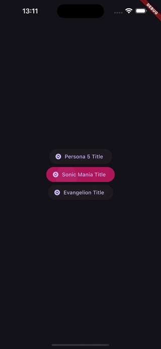
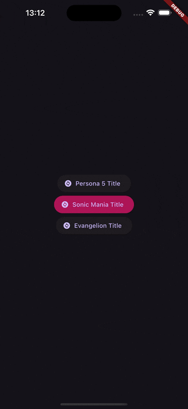
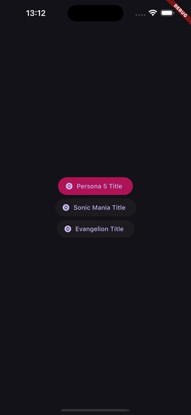

# Fancy Titles ✨

Paquete que incluye splash screens personalizados para aplicaciones Flutter y darles un toque especial. Inspirados en mis videojuegos y series favoritas.

Funciona tanto en modo retrato como en modo paisaje.

## Instalación 💻

Instalar a través del archivo `pubspec.yaml` agregando la dependencia:

```yaml
dependencies:
  fancy_titles:
    git:
      url: https://github.com/sudo-poporin/fancy-titles
      ref: main
```

---

## Uso 📖

Para usar el paquete `fancy_titles`, primero tenés que importar el paquete en tu archivo Dart:

```dart
import 'package:fancy_titles/fancy_titles.dart';
```

Luego, podés usar las pantallas de inicio personalizadas en tu aplicación Flutter. Acá tenés un ejemplo básico de cómo implementar una pantalla de inicio personalizada:

```dart
import 'package:flutter/material.dart';
import 'package:fancy_titles/fancy_titles.dart';

void main() {
  runApp(MyApp());
}

class MyApp extends StatelessWidget {
  @override
  Widget build(BuildContext context) {
    return MaterialApp(
      title: 'Fancy Titles Demo',
      home: Stack(
        children: [
            // Tu pantalla principal
            Scaffold(
                appBar: AppBar(title: Text('Home')),
                body: Center(child: Text('Bienvenido a la aplicación')),
            ),
            // Pantalla de inicio personalizada
            SonicManiaSplash(
                baseText: 'FANCY',
                secondaryText: 'EXAMPLE',
                lastText: 'APP',
            ),
        ],
      ),
    );
  }
}
```

### Aplicación de ejemplo ❤️

Una aplicación de ejemplo está disponible en el directorio `example`. En ella se muestra cómo usar el paquete `fancy_titles`.

### Pantallas hechas 📸

- Sonic Mania
- Persona 5
- Neon Genesis Evangelion

  

## Próximas características 🚀

- Clase contenedora para las pantallas de inicio
- Más pantallas de inicio personalizadas
