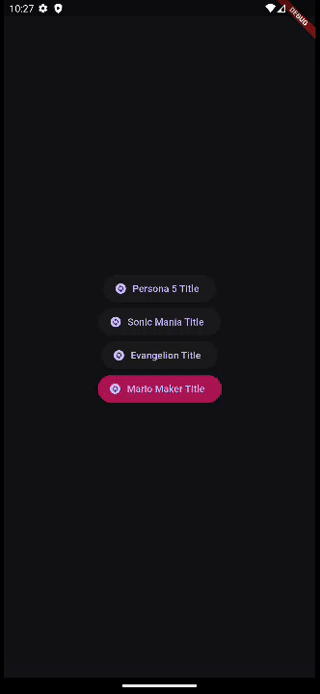

# Fancy Titles ✨

Paquete que incluye splash screens personalizados para aplicaciones Flutter y darles un toque especial. Inspirados en mis videojuegos y series favoritas.

Funciona tanto en modo retrato como en modo paisaje.

## Instalación 💻

Instalar a través del archivo `pubspec.yaml` agregando la dependencia:

```yaml
dependencies:
  fancy_titles:
    git:
      url: https://github.com/sudo-poporin/fancy-titles
      ref: main
```

---

## Uso Rápido 📖

Para usar el paquete `fancy_titles`, primero tenés que importar el paquete en tu archivo Dart:

```dart
import 'package:fancy_titles/fancy_titles.dart';
```

Luego, podés usar las pantallas de inicio personalizadas en tu aplicación Flutter. Acá tenés un ejemplo básico de cómo implementar una pantalla de inicio personalizada:

```dart
import 'package:flutter/material.dart';
import 'package:fancy_titles/fancy_titles.dart';

void main() {
  runApp(MyApp());
}

class MyApp extends StatelessWidget {
  @override
  Widget build(BuildContext context) {
    return MaterialApp(
      title: 'Fancy Titles Demo',
      home: Stack(
        children: [
          // Tu pantalla principal
          Scaffold(
            appBar: AppBar(title: Text('Home')),
            body: Center(child: Text('Bienvenido a la aplicación')),
          ),
          // Pantalla de inicio personalizada
          SonicManiaSplash(
            baseText: 'FANCY',
            secondaryText: 'EXAMPLE',
            lastText: 'APP',
          ),
        ],
      ),
    );
  }
}
```

---

## Pantallas Disponibles 📸

### SonicManiaSplash 🦔

Inspirado en las pantallas de niveles de **Sonic Mania**. Incluye cortinas de colores animadas, barras diagonales deslizantes y texto con efecto de rebote.


**Duración total:** 5 segundos (auto-destrucción automática)

#### Parámetros de SonicManiaSplash

| Parámetro | Tipo | Requerido | Descripción |
|-----------|------|-----------|-------------|
| `baseText` | `String` | ✅ | Primera línea de texto (se muestra en mayúsculas) |
| `secondaryText` | `String?` | ❌ | Segunda línea de texto opcional (se muestra en mayúsculas) |
| `lastText` | `String?` | ❌ | Tercera línea de texto, **máximo 4 caracteres** (se muestra en minúsculas) |

#### Ejemplo de SonicManiaSplash

```dart
SonicManiaSplash(
  baseText: 'STUDIOPOLIS',
  secondaryText: 'ZONE',
  lastText: 'ACT1',
)
```

#### Secuencia de Animación de SonicManiaSplash

1. Las cortinas de colores se expanden y contraen
2. Barras diagonales (naranja, rojo, verde, azul) se deslizan
3. Las barras de texto aparecen con efecto de rebote en cada letra
4. A los 3.5s, las barras de texto se deslizan hacia afuera
5. A los 5s, el widget se desvanece completamente

---

### Persona5Title ❤️

Inspirado en los títulos de capítulo de **Persona 5**. Incluye fondo rojo vibrante, círculos concéntricos en espiral y texto con efecto de trazo.


**Duración total:** 4 segundos (auto-destrucción automática)

#### Parámetros de Persona5Title

| Parámetro | Tipo | Requerido | Default | Descripción |
|-----------|------|-----------|---------|-------------|
| `text` | `String` | ✅ | - | Texto a mostrar (ej: "Takes your heart") |
| `imagePath` | `String?` | ❌ | `null` | Ruta del asset de imagen (ej: retrato de personaje) |
| `withImageBlendMode` | `bool` | ❌ | `false` | Habilita modo de mezcla para la imagen |
| `delay` | `Duration` | ❌ | `125ms` | Retraso antes de iniciar la animación |
| `duration` | `Duration` | ❌ | `3400ms` | Duración de la animación principal |

#### Ejemplo Básico

```dart
Persona5Title(
  text: 'Takes your heart',
)
```

#### Ejemplo con Imagen

```dart
Persona5Title(
  text: 'Takes your heart',
  imagePath: 'assets/images/joker.png',
  withImageBlendMode: true,
)
```

> **Nota:** Si usás `imagePath`, asegurate de agregar el asset en tu `pubspec.yaml`:
>
> ```yaml
> flutter:
>   assets:
>     - assets/images/
> ```

#### Secuencia de Animación de Persona5Title

1. Fondo rojo brillante aparece
2. Después del delay, círculos en espiral (negro/rojo) se animan
3. El texto se desliza desde arriba-derecha con desvanecimiento
4. La imagen (si existe) se muestra con rotación (-0.3 rad)
5. A los 3.4s, todos los elementos se desvanecen
6. A los 4s, el widget desaparece

---

### EvangelionTitle 📺

Inspirado en los títulos de episodio de **Neon Genesis Evangelion**. Incluye fondo oscuro, efectos de destello tipo cruz y texto con la tipografía característica EVA-Matisse.


**Duración total:** 5 segundos (auto-destrucción automática)

#### Parámetros de EvangelionTitle

| Parámetro | Tipo | Requerido | Default | Descripción |
|-----------|------|-----------|---------|-------------|
| `firstText` | `String?` | ❌ | `'NEON'` | Primera línea de texto |
| `secondText` | `String?` | ❌ | `'GENESIS'` | Segunda línea de texto |
| `thirdText` | `String?` | ❌ | `'EVANGELION'` | Tercera línea de texto |
| `fourthText` | `String?` | ❌ | `'EPISODE:1'` | Cuarta línea de texto (número de episodio) |
| `fifthText` | `String?` | ❌ | `'ANGEL ATTACK'` | Quinta línea de texto (título del episodio) |

#### Ejemplo de EvangelionTitle

```dart
EvangelionTitle(
  firstText: 'NEON',
  secondText: 'GENESIS',
  thirdText: 'EVANGELION',
  fourthText: 'EPISODE:24',
  fifthText: 'THE FINAL MESSENGER',
)
```

#### Secuencia de Animación de EvangelionTitle

1. Fondo oscuro aparece
2. A los 450ms, el texto aparece con desvanecimiento y deslizamiento
3. 6 efectos de destello (cruces) se animan con delays escalonados
4. 6 efectos de cortina negra se animan en paralelo
5. A los 3s, el fondo se vuelve transparente
6. A los 5s, el widget se desvanece completamente

---

### MarioMakerTitle 🍄

Inspirado en las pantallas de título de **Super Mario Maker**. Incluye un círculo con efecto de rebote (jelly), una imagen que puede ser un GIF animado, expansión del círculo para revelar el fondo amarillo, y un efecto de iris-out al finalizar.



**Duración total:** 4 segundos (auto-destrucción automática)

#### Parámetros de MarioMakerTitle

| Parámetro | Tipo | Requerido | Default | Descripción |
|-----------|------|-----------|---------|-------------|
| `title` | `String` | ✅ | - | Texto a mostrar después de la expansión del círculo |
| `imagePath` | `String` | ✅ | - | Ruta del asset de imagen (soporta GIFs) |
| `onAnimationStart` | `VoidCallback?` | ❌ | `null` | Callback ejecutado al iniciar la animación (útil para sonidos) |
| `duration` | `Duration` | ❌ | `4s` | Duración total de la animación |
| `circleRadius` | `double` | ❌ | `80` | Radio base del círculo |
| `bottomMargin` | `double` | ❌ | `100` | Distancia desde el fondo de la pantalla al centro del círculo |
| `titleStyle` | `TextStyle?` | ❌ | `null` | Estilo personalizado para el texto del título |
| `irisOutAlignment` | `Alignment` | ❌ | `center` | Hacia dónde contrae el efecto iris-out |
| `irisOutEdgePadding` | `double` | ❌ | `50` | Distancia mínima desde los bordes para el iris-out |

#### Ejemplo Básico

```dart
MarioMakerTitle(
  title: 'COURSE WORLD',
  imagePath: 'assets/images/mario.gif',
)
```

#### Ejemplo con Personalización

```dart
MarioMakerTitle(
  title: 'NEW COURSE!',
  imagePath: 'assets/images/mario.gif',
  duration: const Duration(seconds: 5),
  circleRadius: 100,
  irisOutAlignment: Alignment.bottomRight,
  onAnimationStart: () => audioPlayer.play('mario_sound.mp3'),
)
```

> **Nota:** Si usás `imagePath`, asegurate de agregar el asset en tu `pubspec.yaml`:
>
> ```yaml
> flutter:
>   assets:
>     - assets/images/
> ```

#### Secuencia de Animación de MarioMakerTitle

1. Fondo negro inicial aparece
2. 0s-1.2s: El círculo rebota con efecto jelly
3. 1.2s-1.5s: La imagen escala hacia afuera
4. 1.2s-2s: El círculo se expande revelando el fondo amarillo
5. 1.4s-1.9s: El título se desliza desde arriba
6. 3.5s-4s: El título se desvanece + efecto iris-out simultáneo
7. 4s: El widget se auto-destruye

---

## API Reference 📚

### Resumen de Widgets

| Widget | Inspiración | Duración | Parámetros Requeridos |
|--------|-------------|----------|----------------------|
| `SonicManiaSplash` | Sonic Mania | 5s | `baseText` |
| `Persona5Title` | Persona 5 | 4s | `text` |
| `EvangelionTitle` | Neon Genesis Evangelion | 5s | Ninguno (todos opcionales) |
| `MarioMakerTitle` | Super Mario Maker | 4s | `title`, `imagePath` |

### Fuentes Incluidas

El paquete incluye las siguientes fuentes personalizadas que se usan automáticamente:

| Fuente | Usado en | Descripción |
|--------|----------|-------------|
| `ManiaZoneCard` | SonicManiaSplash | Tipografía estilo Sonic Mania |
| `Persona` | Persona5Title | Tipografía estilo menú de Persona 5 |
| `EVAMatisseClassic` | EvangelionTitle | Tipografía característica de Evangelion |

---

## Personalización 🎨

### Comportamiento Responsivo

Todos los widgets se adaptan automáticamente a diferentes tamaños de pantalla y orientaciones:

- **Modo Retrato:** Texto y elementos se escalan para pantallas verticales
- **Modo Paisaje:** Los elementos se redistribuyen para pantallas horizontales
- **Tamaño de fuente dinámico:** Se calcula basándose en el ancho de pantalla

### Colores Principales

#### Colores de Persona 5

- Rojo principal: `#FF1518`
- Negro: `#000000`
- Blanco (trazo): `#FFFFFF`

#### Colores de Evangelion

- Fondo oscuro: `#040404`
- Fondo claro: `#F1EEFF`

#### Colores de Sonic Mania

- Colores de cortinas: azul, naranja, ámbar, verde, amarillo
- Colores de barras: rojo, naranja, azul, verde

#### Colores de Mario Maker

- Amarillo: `#FFC800`
- Negro: `#000000`

---

## Aplicación de Ejemplo ❤️

Una aplicación de ejemplo está disponible en el directorio `example/`. En ella se muestra cómo usar las tres pantallas del paquete `fancy_titles`.

Para ejecutar el ejemplo:

```bash
cd example
flutter pub get
flutter run
```

---

## Próximas Características 🚀

- Clase contenedora para las pantallas de inicio
- Más pantallas de inicio personalizadas
- Parámetros de personalización de colores
- Callbacks de finalización de animación
